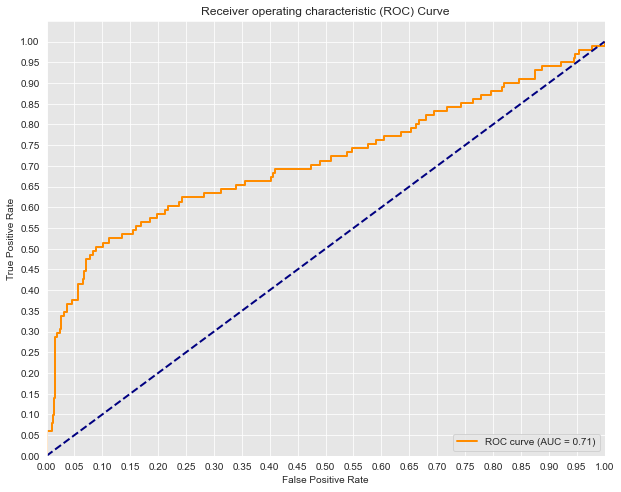

# dsc-phase3-project-pam

## 1. Project overview

### Project Goal

To predict whether there is a pattern of customers who will ("soon") stop doing business with SyriaTel, a telecommunications company.

### Objectives

To determine if there is a predictive pattern of customers who will ("soon") stop doing bussiness with SyriaTel.

## 2. Business understanding

The audience are the telecom business staff whose interest is reducing how much money is lost because of customers who don’t want to stay with the company very long.

### Question

Are there any predictable patterns for customers who do not want to stay with the network for long?

### Dataset

We use the Churn in Telecom's dataset

## 2. Data preparation

Data preparation included formating columns to rename them correctly, removing extra spaces, cheking for missing values, defining the features (X) and target (y) varaibles, dealing with categorical variables, and encoding the target variables from boolean to binary.
The feaatures selected are 'account_length', 'area_code', 'total_day_charge', 'total_eve_charge', 'total_night_charge', 'total_intl_charge.

## 3. Modelling

### 3.1. Modelling was first done using the statsmodels

Statsmodel was used to fit the baseline model.
The results was a Pseudo R-Squared of 0.07172 which meant that the model explains only 7.17% of the variability
The coefficients results indicate that total_day_charge, total_eve_charge, total_night_charge, total_intl_charge are significant and influence whether whether one churns or not.A unit increase in international charge increases the chance of churn by 29 percent.

### 3.2. Modelling using scikit-learn

This involved selecting the features and target variables, training and split the data, initiating and fitting the Logistic regression model using the train dataset. A plot was then made for the coeficients vs the features as shown below

The plot shows that a unit increase in international charge increases the chance of churn by 31 percent

## 4. Model evaluation

### 4.1. RMSE

Evaluation of the model RMSE is -0.16677745513067221. A negative result shows that the model is performing poorly. The model produced an accuracy of 86%
The f1 score for the class 0 is 0.92. But the f1 score for class 1 is very low 0.02. This is due to the data imbalances, there are more instances for class 0 (2284) compared to class 1(382).

### 4.2 Confusion Matrix

confusion matrix produced the same result in terms of the accuracy

### 4.3 Evaluation using ROC and AUC

AUC: 0.7116467830528636
The model has a 71.16% chance of predictily correctly the negative and positive classes

## Hyperparameter Tuning in Decision Trees

RMSE is 0.336 which is better that the baseline model where the RMSE was negative.

The model has a 33.6% chance of variability.

## 5. Conclusion

International Calls seems to be the main reason why customers may want to churn SyriaTel company

It may be good to explore other variables such compare the international tarrifs by other companies in the same sector

One can also explore the local costs for the competitors in the market
